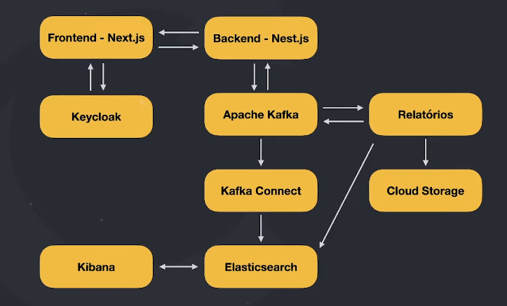
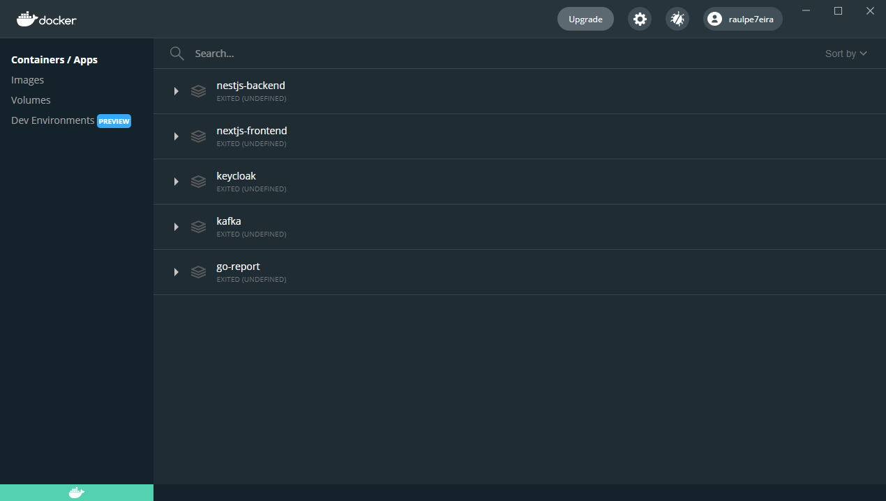
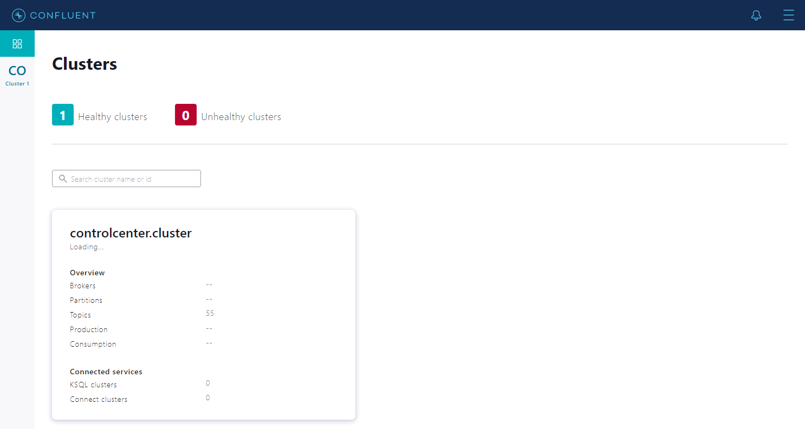
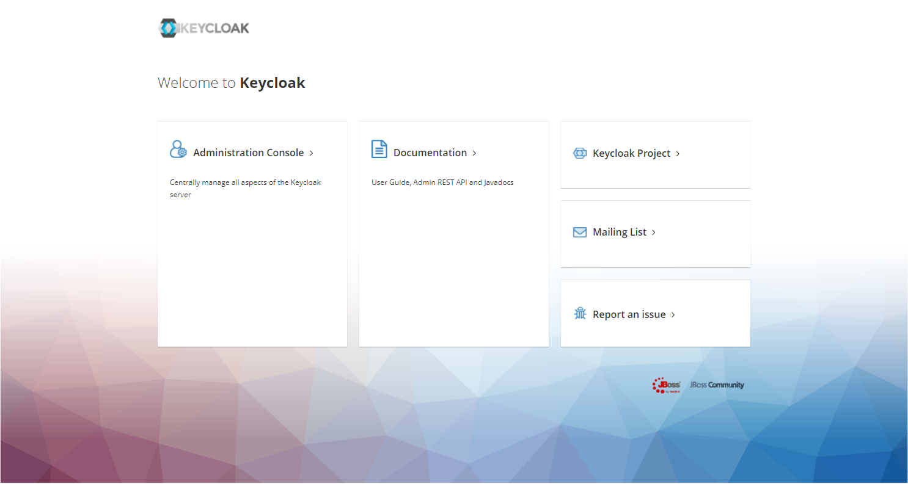
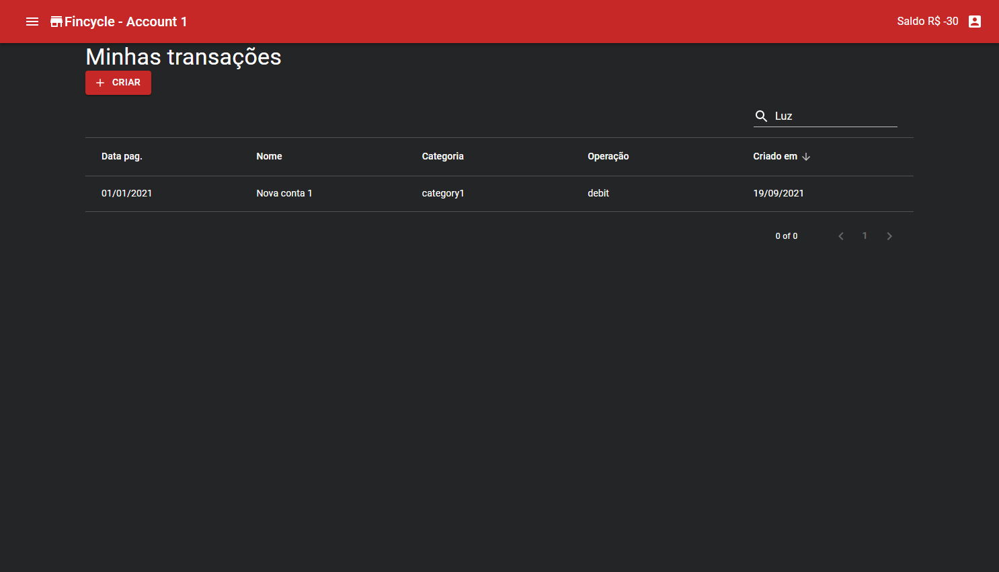

# Imersão Full Stack (4ª Edition) | Fincycle

This repository is the code corresponding to the [imersão full stack](https://imersao.fullcycle.com.br) lab.

> The project simulates a financial APP that allows to debit and credit transactions, in addition to generating reports.

## Architecture

## Infrastructures

| CONTAINERS | KAFKA | KEYCLOAK |
|--|--|--|
|  |  |  |

## Screens

| NEXTJS-FRONTEND |
|--|
|  |
